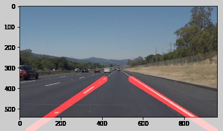

# 🛣️ Road Lane Detection

[](https://github.com/Sanjays2402/Road-Lane-Detection-Using-Computer-Vision/actions/workflows/tests.yml)


A small, well-tested computer-vision pipeline that finds lane lines in road images and dashcam video. Originally a Udacity Self-Driving Car Nanodegree notebook; refactored here into an installable Python package with a CLI, tests, and CI.



## What's new vs. the original notebook

| | Notebook | This package |
|---|---|---|
| Packaging | One `.ipynb` with hard-coded `C:/Users/Sharath/...` paths | `pip install -e .`, importable, CLI |
| Architecture | Free functions + script-style globals | Stateful `LaneDetector` + dataclass config |
| Color filtering | Mentioned in README, **not** in pipeline | HLS white+yellow mask, on by default |
| Edge detection | Blur applied to *RGB* (bug), then Canny on color image | Color filter → gray → blur → Canny |
| Geometry | Crashes on vertical Hough segments (divide-by-zero) | Vertical segments dropped cleanly |
| ROI | Hard-coded for 960×540 | Fractional trapezoid, scales to any resolution |
| Video | Per-frame detection, jittery overlay | Optional exponential temporal smoothing, coasts through dropped frames |
| Tests | None | 12 pytest cases, runs in CI on Python 3.9/3.11/3.12 |
| CLI | None | `lane-detect image …` and `lane-detect video …` |

## Install

```bash
pip install -e .
# Add video support:
pip install -e ".[video]"
```

For headless servers (no GUI), substitute `opencv-python-headless` for `opencv-python`.

## Usage

### Python API

```python
import cv2
from lane_detection import LaneDetector, LaneDetectorConfig

detector = LaneDetector(LaneDetectorConfig(smoothing_alpha=0.2))

# Image must be RGB (matplotlib / moviepy convention).
bgr = cv2.imread("dashcam.jpg")
rgb = cv2.cvtColor(bgr, cv2.COLOR_BGR2RGB)

overlay = detector.process(rgb)
print(overlay.left, overlay.right)        # slope/intercept (or None)
cv2.imwrite("out.jpg", cv2.cvtColor(overlay.image, cv2.COLOR_RGB2BGR))
```

`LaneOverlay` exposes the rendered image, the left/right `LineParams`, and the masked Canny edges (handy for debugging).

### CLI

```bash
# Single image
lane-detect image dashcam.jpg -o out.jpg

# Whole folder
lane-detect image test_images/ -o test_images_output/

# Video with default smoothing (alpha = 0.2)
lane-detect video drive.mp4 -o drive_lanes.mp4

# Tighter smoothing for very shaky footage
lane-detect video drive.mp4 -o drive_lanes.mp4 --smoothing 0.1
```

## Pipeline overview

```
Input frame (RGB)
  → HLS color filter (white + yellow)
  → Grayscale
  → Gaussian blur (5×5)
  → Canny edge detection (50 / 150)
  → Trapezoidal ROI mask
  → Probabilistic Hough transform
  → Slope filtering & sign-based left/right split
  → Per-side averaging in slope-intercept space
  → (Video) Exponential smoothing across frames
  → Extrapolate to image-bottom + horizon
  → Weighted overlay
```

## Configuration

Every knob lives on `LaneDetectorConfig`. Some useful ones:

```python
LaneDetectorConfig(
    use_color_filter=True,     # turn off to compare against the classical pipeline
    canny_low=50, canny_high=150,
    hough_threshold=20, hough_min_line_len=20, hough_max_line_gap=300,
    min_abs_slope=0.4, max_abs_slope=2.0,
    smoothing_alpha=0.2,       # None disables smoothing
    line_color=(255, 0, 0), line_thickness=10,
)
```

The trapezoidal ROI is a fractional `TrapezoidROI` so it scales with the input image:

```python
from lane_detection.roi import TrapezoidROI
cfg = LaneDetectorConfig(roi=TrapezoidROI(top_y=0.6))
```

## Development

```bash
git clone https://github.com/Sanjays2402/Road-Lane-Detection-Using-Computer-Vision.git
cd Road-Lane-Detection-Using-Computer-Vision
python -m venv .venv && source .venv/bin/activate
pip install -e ".[dev]" opencv-python-headless
pytest
```

Tests use synthetic images, so they don't depend on the original Udacity footage and run in well under a second.

## Project layout

```
lane_detection/
├── __init__.py        # public API
├── pipeline.py        # LaneDetector + LaneOverlay
├── color.py           # HLS white/yellow mask
├── roi.py             # fractional trapezoidal ROI
├── lines.py           # slope/intercept geometry
└── cli.py             # `lane-detect` entrypoint
tests/
└── test_pipeline.py   # 12 cases: synthetic + edge cases
Finding Lane Lines- CARND-Term-1- Submission.ipynb   # original notebook (kept for archival)
```

## Limitations

This is a **classical** pipeline. It does not do well on:

- Tight curves (assumes near-linear lanes inside the ROI)
- Snow, heavy rain, or frames where lane markings are missing
- Lane changes (the slope filter assumes one lane per side)

For those, a CNN-based segmentation model (e.g. SCNN, LaneNet) is the right tool. This package is most useful as a fast, dependency-light baseline and as a teaching reference.

## License

MIT — see the original notebook for the Udacity course context.

## Author

**Sanjay Santhanam** — [@Sanjays2402](https://github.com/Sanjays2402)
